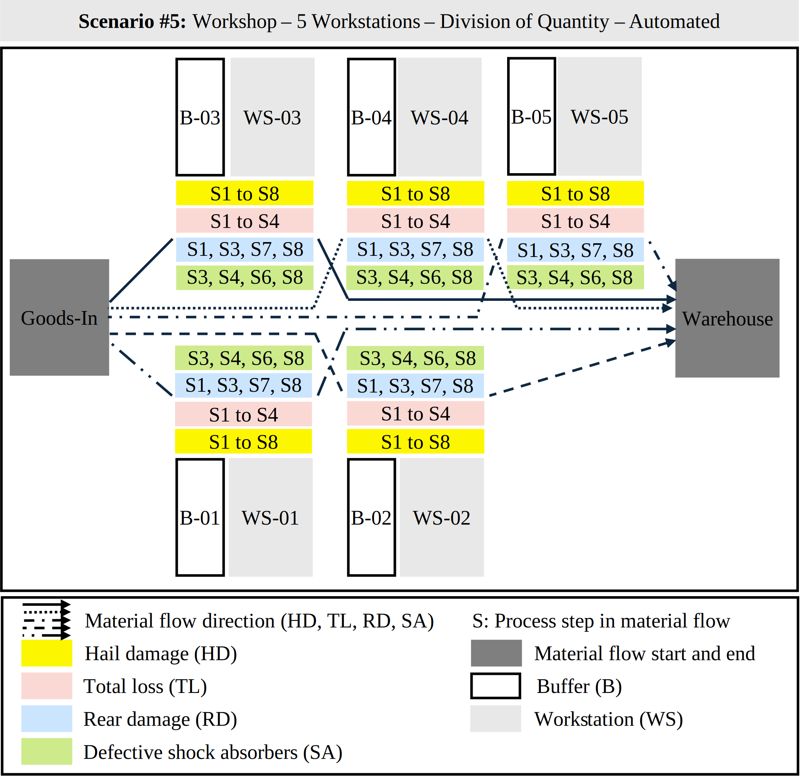

# Scenario 5: Workshop with Mixed Quality Portfolio (5 Workstations)

**Date:** January 9, 2025
**Duration:** 10:54:30 - 11:29:46

## Summary
📊 **10 cars** | 🎯 **HD (60%), TL (10%), SA (10%), RD (20%)** | 🏭 **5 workstations** | 👷 **Automated processing** | ⏱️ **35.77 minutes** | ✅ **100% completion**

## Table of Contents
- [1. Scenario Overview](#1-scenario-overview)
  - [1.1 Key Characteristics](#11-key-characteristics)
  - [1.2 Material Flow](#12-material-flow)
  - [1.3 Files & Resources](#13-files--resources)
- [2. System Configuration](#2-system-configuration)
  - [2.1 Workstation Layout](#21-workstation-layout)
  - [2.2 Workstation Distances](#22-workstation-distances)
  - [2.3 Component Reference](#23-component-reference)
- [3. Disassembly Process](#3-disassembly-process)
  - [3.1 Quality-Based Routing](#31-quality-based-routing)
  - [3.2 Process Step Mapping](#32-process-step-mapping)
- [4. Production Schedule](#4-production-schedule)
- [5. Scenario Analysis](#5-scenario-analysis)
  - [5.1 System-Level Indicators](#51-system-level-indicators)
  - [5.2 Workstation Performance](#52-workstation-performance)
  - [5.3 Production Order Analysis](#53-production-order-analysis)
- [6. Data Quality Notes](#6-data-quality-notes)

<!-- ================================================== -->
<!-- SCENARIO OVERVIEW -->
<!-- ================================================== -->
## 1. Scenario Overview

This scenario presents a 5-workstation workshop configuration processing 10 cars with a mixed quality portfolio.

### 1.1 Key Characteristics

Table 1.1 summarizes the key characteristics of this scenario. The configuration uses a workshop layout with automated processing, where each vehicle completes all disassembly operations at one workstation.

**Table 1.1.** Key characteristics of Scenario 5

| Characteristic | Value |
|---------------|--------|
| **System design** | Workshop with 5 workstations (WS-01 to WS-05) |
| **Product portfolio** | 10 cars with mixed quality types |
| **Product mix** | HD (60%), TL (10%), SA (10%), RD (20%) |
| **Disassembly depths** | Variable (quality-dependent) |
| **Total units** | 10 cars (PO-01 to PO-10) |
| **Processing type** | Automated (operator uses cordless screwdriver) |
| **Flow pattern** | Single-station flow (no inter-station movement) |

 

### 1.2 Material Flow
Figure 1.1 shows the material flow diagram, which illustrates how EOL products are routed through the disassembly system.

**Figure 1.1:** Material flow for mixed quality portfolio with single-station processing

 

### 1.3 Files & Resources

Table 1.2 lists all the data, documentation, and production order (PO) files for this disassembly scenario. For a more detailed description of the Excel spreadsheet, please refer to the [README.md](../../README.md) file.

**Table 1.2.** Complete file listing for Scenario 5

| **Category** | **File** | **Description** |
|--------------|----------|-----------------|
| **Data files** | [`scenario_05_data_raw.csv`](data/scenario_05_data_raw.csv) | Raw material flow data (986 recorded events) |
| | [`scenario_05_data_analyzed.xlsx`](data/scenario_05_data_analyzed.xlsx) | Cleaned data with analysis sheets |
| **Material flow** | [`scenario_05_material_flow.svg`](figures/scenario_05_material_flow.svg) | System layout and material flow diagram |
| **Disassembly sequences** | [`scenario_05_sequence_HD.svg`](figures/scenario_05_sequence_HD.svg) | HD (Hail damage) disassembly sequence |
| | [`scenario_05_sequence_TL.svg`](figures/scenario_05_sequence_TL.svg) | TL (Total loss) disassembly sequence |
| | [`scenario_05_sequence_SA.svg`](figures/scenario_05_sequence_SA.svg) | SA (Shock absorber) disassembly sequence |
| | [`scenario_05_sequence_RD.svg`](figures/scenario_05_sequence_RD.svg) | RD (Rear damage) disassembly sequence |
| **Work instructions** | [`scenario_05_WI_HD.pdf`](figures/scenario_05_WI_HD.pdf) | Work instructions for HD quality type |
| | [`scenario_05_WI_TL.pdf`](figures/scenario_05_WI_TL.pdf) | Work instructions for TL quality type |
| | [`scenario_05_WI_SA.pdf`](figures/scenario_05_WI_SA.pdf) | Work instructions for SA quality type |
| | [`scenario_05_WI_RD.pdf`](figures/scenario_05_WI_RD.pdf) | Work instructions for RD quality type |

 

<!-- ================================================== -->
<!-- SYSTEM CONFIGURATION -->
<!-- ================================================== -->
## 2. System Configuration

### 2.1 Workstation Layout

Table 2.1 shows the physical configuration of the workstations within the system. B-Transfer serves as the final output buffer for finished components.

**Table 2.1.** Workstation layout and buffer configuration (Source: [`scenario_05_material_flow.svg`](figures/scenario_05_material_flow.svg))

| Workstation | Position | Buffer before | Buffer after | Equipment type |
|---------|----------|---------------|--------------|----------------|
| WS-01 | Workshop workstation 1 | B-Goods-In | B-Transfer | Automated |
| WS-02 | Workshop workstation 2 | B-Goods-In | B-Transfer | Automated |
| WS-03 | Workshop workstation 3 | B-Goods-In | B-Transfer | Automated |
| WS-04 | Workshop workstation 4 | B-Goods-In | B-Transfer | Automated |
| WS-05 | Workshop workstation 5 | B-Goods-In | B-Transfer | Automated |

 

### 2.2 Workstation Distances

Table 2.2 shows the physical distances between workstations and key locations in the system. These distances are measured in meters and represent the shortest path between locations.

**Table 2.2.** Workstation distance matrix in meters (measured approximately)

|            | Goods-in | WS-01 | WS-02 | WS-03 | WS-04 | WS-05 | Warehouse |
|------------|----------|-------|-------|-------|-------|-------|-----------|
| Goods-in   | 0        | 3.2   | 5.4   | 3.2   | 5.4   | 7.8   | 5.2       |
| WS-01      | 3.2      | 0     | 2.5   | 4.0   | 4.7   | 6.4   | 2.0       |
| WS-02      | 5.4      | 2.5   | 0     | 4.7   | 4.0   | 4.7   | 2.0       |
| WS-03      | 3.2      | 4.0   | 4.7   | 0     | 2.5   | 5.0   | 2.0       |
| WS-04      | 5.4      | 4.7   | 4.0   | 2.5   | 0     | 2.5   | 2.0       |
| WS-05      | 7.8      | 6.4   | 4.7   | 5.0   | 2.5   | 0     | 2.0       |
| Warehouse  | 5.2      | 2.0   | 2.0   | 2.0   | 2.0   | 2.0   | 0         |

 

### 2.3 Component Reference

Table 2.3 lists all the components that can be disassembled from the cars. Each component is assigned a recovery destination based on its condition and potential for reuse.

**Table 2.3.** Component codes and their recovery destinations (Source: Disassembly sequence diagrams, [figures/](figures/))

| Code | Component | Quantity | Destination |
|------|-----------|----------|-------------|
| BOSP | Body & spoiler | 1+1 | Recycle |
| BAT | Battery | 1 | Reuse |
| RT | Rear tires | 2 | Recycle/Reuse |
| FT | Front tires | 2 | Reuse |
| FAXS | Front axis with shock absorbers | 1 | None (intermediate assembly) |
| SSA | Small shock absorbers | 2 | Recycle |
| FAX | Front axis | 1 | Remanufacture |
| CHS | Chassis | 1 | Reuse |
| CORE | Chassis with systems and engine (excluding rear axis) | 1 | Reuse |
| BSA | Big shock absorbers | 2 | Remanufacture |
| RAX (HD) | Rear axis | 1 | Recycle |
| RAX (RD) | Rear axis | 1 | Repair |
| CRE (TL) | Chassis, remaining systems, engine | 1 | Recycle |
| CSEB-NABS (SA) | Chassis, systems, engine, body | 1 | Recycle |

 

<!-- ================================================== -->
<!-- DISASSEMBLY PROCESS -->
<!-- ================================================== -->
## 3. Disassembly Process

### 3.1 Quality-Based Routing

Table 3.1 illustrates the routing patterns for each quality type through the disassembly system. Each vehicle follows a specific route based on its quality type, with all processing done at a single workstation.

**Table 3.1.** Quality-dependent routing and target components (Source: [`scenario_05_material_flow.svg`](figures/scenario_05_material_flow.svg))

| Quality type | Count | Material flow | Target components | Remaining |
|--------------|-------|----------------------|-------------------|-----------|
| **HD** (Hail damage) | 6 | WS-01, WS-02, WS-03, WS-04, WS-05 | BOSP, BAT, RT, FT, FAXS, SSA, FAX, CHS, BSA | RAX (HD) |
| **TL** (Total loss) | 1 | WS-01 | BOSP, BAT, RT, FT | CRE (TL) |
| **SA** (Shock absorber) | 1 | WS-05 | BOSP, RT, FT, SSA, BSA | CSEB-NABS (SA) |
| **RD** (Rear damage) | 2 | WS-01, WS-02 | BOSP, RT, BSA | RAX (RD) |

 

### 3.2 Process Step Mapping

Table 3.2 maps which disassembly steps are performed for each quality type. All stations are capable of performing all disassembly steps. The actual station assignment for each PO was determined by availability when the PO entered the system.

**Table 3.2.** Process steps by quality type (Source: [`scenario_05_material_flow.svg`](figures/scenario_05_material_flow.svg))

| Step | Operation | HD | TL | SA | RD | Workstation(s) |
|------|-----------|----|----|----|----|------------|
| S1 | Remove body & spoiler | ✓ | ✓ | ✓ | ✓ | All |
| S2 | Remove battery | ✓ | ✓ | - | - | All |
| S3 | Remove rear tires | ✓ | ✓ | ✓ | ✓ | All |
| S4 | Remove front tires | ✓ | ✓ | ✓ | - | All |
| S5 | Remove front axis with shock absorbers | ✓ | - | - | - | All |
| S6 | Remove small shock absorbers | ✓ | - | ✓ | - | All |
| S7 | Remove chassis/core | ✓ | - | - | - | All |
| S8 | Remove big shock absorbers | ✓ | - | ✓ | ✓ | All |

 

<!-- ================================================== -->
<!-- PRODUCTION SCHEDULE -->
<!-- ================================================== -->
## 4. Production Schedule

Table 4.1 shows the arrival schedule and processing status of all production orders. All production orders were completed successfully.

**Table 4.1.** Production order schedule and completion status (Source: [`scenario_05_data_analyzed.xlsx`](data/scenario_05_data_analyzed.xlsx), sheets "delivery_times" and "extraction")

| Order | Arrival time | Quality type | Material flow | Status |
|-------|--------------|--------------|------------------|--------|
| PO-01 | 10:54:30 | HD | WS-03 | Complete |
| PO-02 | 10:55:30 | TL | WS-01 | Complete |
| PO-03 | 10:56:30 | HD | WS-02 | Complete |
| PO-04 | 10:57:30 | HD | WS-04 | Complete |
| PO-05 | 10:58:30 | SA | WS-05 | Complete |
| PO-06 | 10:59:30 | RD | WS-01 | Complete |
| PO-07 | 11:01:30 | HD | WS-03 | Complete |
| PO-08 | 11:01:30 | RD | WS-02 | Complete |
| PO-09 | 11:03:30 | HD | WS-05 | Complete |
| PO-10 | 11:04:30 | HD | WS-01 | Complete |

 

<!-- ================================================== -->
<!-- SCENARIO ANALYSIS -->
<!-- ================================================== -->
## 5. Scenario Analysis

> 📊 **Note on Data Presentation:** The tables and metrics in this section provide a concise summary. For detailed analysis, refer to the Excel analysis file ([`scenario_05_data_analyzed.xlsx`](data/scenario_05_data_analyzed.xlsx)). This file contains the complete dataset and calculations.

### 5.1 System-Level Indicators

Table 5.1 presents the overall system throughput performance. All ten production orders had a completion rate of 100%.

**Table 5.1.** System-level performance indicators (Source: [`scenario_05_data_analyzed.xlsx`](data/scenario_05_data_analyzed.xlsx), sheet "analysis")

<table>
<tr><th>Indicator</th><th>Value</th></tr>
<tr><td>Total processing time (minutes)</td><td>35.77</td></tr>
<tr><td>POs processed (#)</td><td>10</td></tr>
<tr><td>System throughput rate (POs/hour)</td><td>16.8</td></tr>
<tr><td>Total components planned (#)[1]</td><td>65</td></tr>
<tr><td>Total components completed (#)[1]</td><td>65</td></tr>
<tr><td>Overall completion rate (%)</td><td>100</td></tr>
</table>

Notes:

[1] Component counts based on target components defined in Table 3 of the [README.md](../../README.md). Components are counted by their codes (e.g., BOSP, RT, BSA) as defined in Table 2.3, where each code represents one component unit regardless of quantity.

  

Table 5.2 summarizes the total number of components of each type that were disassembled. The summary reflects the mixed quality portfolio with different disassembly depths.

**Table 5.2.** Component processing summary (Source: [`scenario_05_data_analyzed.xlsx`](data/scenario_05_data_analyzed.xlsx), sheet "analysis")

| Code | Component | Quantity | Instances | Total components disassembled |
|------|-----------|----------|-----------|-------------------------------|
| BOSP | Body & spoiler | 1+1 | 10 | 20 |
| BAT | Battery | 1 | 7 | 7 |
| RT | Rear tires | 2 | 10 | 20 |
| FT | Front tires | 2 | 8 | 16 |
| FAX | Front axis | 1 | 6 | 6 |
| SSA | Small shock absorbers | 2 | 7 | 14 |
| CHS | Chassis | 1 | 6 | 6 |
| BSA | Big shock absorbers | 2 | 9 | 18 |
| CORE | Chassis with systems and engine | 1 | 2 | 2 |
| **Total** | **-** | **-** | **65** | **109** |

Note: Only target components shown. Intermediate assemblies (FAXS, CRAXS, CREW) and remaining components (RAX, CRE, CSEB-NABS) are excluded from this count.

 

### 5.2 Workstation Performance

Table 5.3 shows the utilization and workload distribution across workstations. The average utilization across all workstations is 69.5%.

**Table 5.3.** Workstation performance indicators (Source: [`scenario_05_data_analyzed.xlsx`](data/scenario_05_data_analyzed.xlsx), sheet "analysis")

| Indicator | WS-01 | WS-02 | WS-03 | WS-04 | WS-05 |
|--------|-------|-------|-------|-------|-------|
| POs processed | 3/10 | 2/10 | 2/10 | 1/10 | 2/10 |
| Components disassembled | 16 | 12 | 16 | 8 | 13 |
| Total busy time (seconds) | 1,950 | 1,201 | 1,486 | 1,155 | 1,665 |
| Total busy time (minutes) | 32.5 | 20.0 | 24.8 | 19.3 | 27.8 |
| Utilization rate (%) | 90.9 | 56.0 | 69.2 | 53.8 | 77.6 |
| Quality types handled | HD, TL, RD | HD, RD | HD | HD | HD, SA |

 

### 5.3 Production Order Analysis

Table 5.4 shows the handling time, in seconds, for each component across all production orders. The handling time includes both the disassembly time and the waiting time at a workstation.

**Table 5.4.** Component handling times per production order (seconds)
*Source: [`scenario_05_data_analyzed.xlsx`](data/scenario_05_data_analyzed.xlsx) - Process_calculation sheet*

| Step | Component | Avg (s) | Std (s) | PO-01 | PO-02 | PO-03 | PO-04 | PO-05 | PO-06 | PO-07 | PO-08 | PO-09 | PO-10 |
|------|-----------|---------|---------|-------|-------|-------|-------|-------|-------|-------|-------|-------|-------|
| S1 | BOSP | 121 | 44 | 113 | 135 | 60 | 180 | 165 | 105 | 76 | 75 | 180 | 120 |
| S2 | BAT | 85 | 21 | 76 | 121 | 75 | 75 | - | - | 60 | - | 104 | 82 |
| S3 | RT | 92 | 41 | 45 | 60 | 60 | 105 | 165 | 60 | 60 | 121 | 105 | 143 |
| S4 | FT | 126 | 80 | 120 | 105 | 91 | 75 | 316 | - | 134 | - | 105 | 60 |
| S5 | FAXS | 153 | 46 | 199 | - | 76 | 195 | - | - | 156 | - | 127 | 164 |
| S6 | SSA | 117 | 31 | 86 | - | 148 | 150 | 120 | - | 81 | - | 143 | 91 |
| S7 | CHS/CORE | 189 | 70 | 150 | - | 138 | 270 | - | 270 | 105 | 120 | 264 | 196 |
| S8 | BSA | 114 | 52 | 75 | - | 208 | 114 | 192 | 89 | 90 | 89 | 109 | 59 |

  

Table 5.5 shows the actual disassembly time, in seconds, for each component across all production orders. Disassembly time represents only active processing duration (excludes waiting time).

**Table 5.5.** Component disassembly times per production order (seconds) (Source: [`scenario_05_data_analyzed.xlsx`](data/scenario_05_data_analyzed.xlsx), sheet "analysis")

| Step | Component | Avg (s) | Std (s) | PO-01 | PO-02 | PO-03 | PO-04 | PO-05 | PO-06 | PO-07 | PO-08 | PO-09 | PO-10 |
|------|-----------|---------|---------|-------|-------|-------|-------|-------|-------|-------|-------|-------|-------|
| S1 | BOSP | 81 | 33 | 74 | 120 | 30 | 136 | 106 | 75 | 45 | 60 | 90 | 74 |
| S2 | BAT | 35 | 24 | 17 | 60 | 15 | 60 | - | - | 15 | - | 60 | 15 |
| S3 | RT | 61 | 40 | 15 | 29 | 45 | 61 | 106 | 29 | 14 | 105 | 91 | 113 |
| S4 | FT | 85 | 79 | 45 | 75 | 46 | 31 | 270 | - | 105 | - | 75 | 30 |
| S5 | FAXS | 133 | 32 | 153 | - | 88 | 179 | - | - | 129 | - | 112 | 134 |
| S6 | SSA | 89 | 38 | 71 | - | 148 | 120 | 89 | - | 36 | - | 98 | 61 |
| S7 | CHS/CORE | 128 | 68 | 105 | - | 123 | 240 | - | 210 | 76 | 75 | 150 | 45 |
| S8 | BSA | 75 | 49 | 45 | - | 166 | 45 | 150 | 45 | 30 | 74 | 75 | 44 |

  

Table 5.6 summarizes the performance indicators for each production order. All production orders achieved 100% completion rate.

**Table 5.6.** Production order performance indicators (Source: [`scenario_05_data_analyzed.xlsx`](data/scenario_05_data_analyzed.xlsx), sheet "analysis")

<table>
<tr><th>Indicator</th><th>PO-01</th><th>PO-02</th><th>PO-03</th><th>PO-04</th><th>PO-05</th><th>PO-06</th><th>PO-07</th><th>PO-08</th><th>PO-09</th><th>PO-10</th></tr>
<tr><td>Handling time (seconds)[1]</td><td>864</td><td>421</td><td>856</td><td>1,164</td><td>958</td><td>524</td><td>762</td><td>405</td><td>1,137</td><td>915</td></tr>
<tr><td>Disassembly time (seconds)[2]</td><td>525</td><td>284</td><td>661</td><td>872</td><td>721</td><td>359</td><td>450</td><td>314</td><td>751</td><td>516</td></tr>
<tr><td>Waiting time (seconds)[3]</td><td>16</td><td>16</td><td>31</td><td>16</td><td>31</td><td>256</td><td>406</td><td>511</td><td>527</td><td>542</td></tr>
<tr><td>Lead time (seconds)[4]</td><td>-</td><td>-</td><td>-</td><td>-</td><td>-</td><td>-</td><td>-</td><td>-</td><td>-</td><td>-</td></tr>
<tr><td>Components planned (#)</td><td>8</td><td>4</td><td>8</td><td>8</td><td>5</td><td>4</td><td>8</td><td>4</td><td>8</td><td>8</td></tr>
<tr><td>Components completed (#)</td><td>8</td><td>4</td><td>8</td><td>8</td><td>5</td><td>4</td><td>8</td><td>4</td><td>8</td><td>8</td></tr>
<tr><td>Completion rate (%)</td><td>100</td><td>100</td><td>100</td><td>100</td><td>100</td><td>100</td><td>100</td><td>100</td><td>100</td><td>100</td></tr>
</table>

Notes:

[1] Handling time: Total duration from component entry to exit at workstation (includes disassembly + movement time).

[2] Disassembly time: Active processing duration (excludes waiting time).

[3] Waiting time: Duration spent in buffer before processing.

[4] Lead time: Total duration from production order arrival to completion.

 

<!-- ================================================== -->
<!-- DATA QUALITY NOTES -->
<!-- ================================================== -->

## 6. Data Quality Notes

Table 6.1 summarizes the data processing pipeline and event counts. A signal-to-noise ratio of 26% was achieved after filtering. For additional details, see the [`scenario_05_data_analyzed.xlsx`](data/scenario_05_data_analyzed.xlsx) file, specifically the "pre-process", "extraction", and "process_calculation" sheets.

**Table 6.1.** Data quality statistics showing processing stages

| Stage | Event count | Description |
|-------|-------------|-------------|
| **Raw events** | 986 | Original recorded events from IT system |
| **Preprocessed** | 1,002 | +16 events added during preprocessing |
| **Clean events** | 259 | Final usable events after cleaning |
| - OK (from raw) | 211 | Events validated from raw data (includes "OK - Prev Missing") |
| - Cleaned | 30 | Manually corrected events |
| - Calculated | 8 | Estimated from averages |
| - Start | 10 | Manually added start events |
| - Missing | 1 | Missing events (excluded) |
| **Filtered noise** | 743 | Events removed as noise (74%) |
| **Signal-to-noise ratio** | 26% | Percentage of usable data |